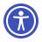

# Horiseon Social Solution Services, Inc.
Website Accessibilty Standards

##Website

## Items Added:
1. Simantec HTML elements.
2. Image elements have alt descriptions.
3. Accesibilty standards

## How it works
Accessibilty standards allow for website to be navigatable for users with disabilties or users not using a mouse. 

## License 
2019 Horiseon Social Solution Services, Inc.

## Link
https://ortizjavier10.github.io/horiseon-social-solution-services-website/
